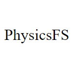

# physfs

[PhysicsFS](https://icculus.org/physfs/) is a library to provide abstract access to various archives. It is intended for use in video games, and the design was somewhat inspired by Quake 3's file subsystem. The programmer defines a "write directory" on the physical filesystem. No file writing done through the PhysicsFS API can leave that write directory, for security. For example, an embedded scripting language cannot write outside of this path if it uses PhysFS for all of its I/O, which means that untrusted scripts can run more safely. Symbolic links can be disabled as well, for added safety. For file reading, the programmer lists directories and archives that form a "search path". Once the search path is defined, it becomes a single, transparent hierarchical filesystem. This makes for easy access to ZIP files in the same way as you access a file directly on the disk, and it makes it easy to ship a new archive that will override a previous archive on a per-file basis. Finally, PhysicsFS gives you platform-abstracted means to determine if CD-ROMs are available, the user's home directory, where in the real filesystem your program is running, etc.

## Links

* [Official website](https://icculus.org/physfs/)
* [Mercurial repository](https://hg.icculus.org/icculus/physfs/)
* [Bintray package](https://bintray.com/expl0it3r/Conan/physfs)

## Versions

* Stable: 3.0.1
* Latest: Source
